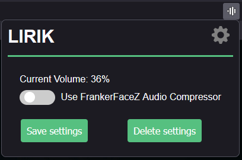
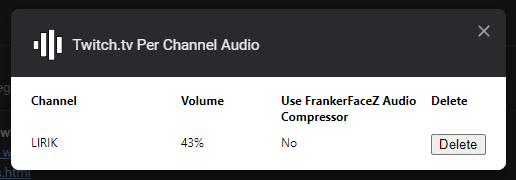
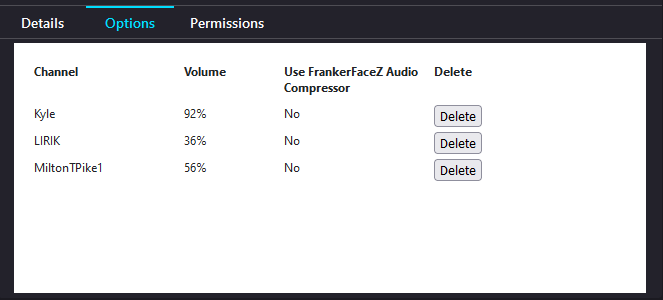

# Twitch Per Channel Audio Settings

Chrome and Firefox extension for Twitch.tv. Enables having different audio settings per channel.

It has two options:

- Set volume
- Use FrankerFaceZ Audio Compressor (if FFZ is installed)

VOD and Clip pages are not supported.

Other browsers not tested.

## Screenshots

